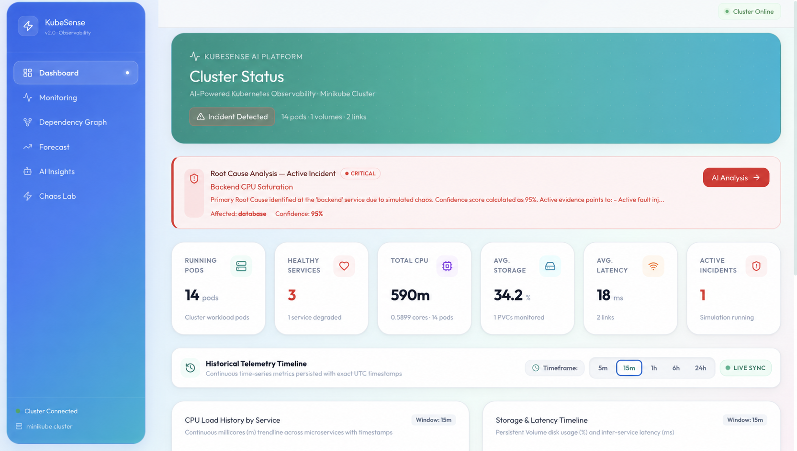
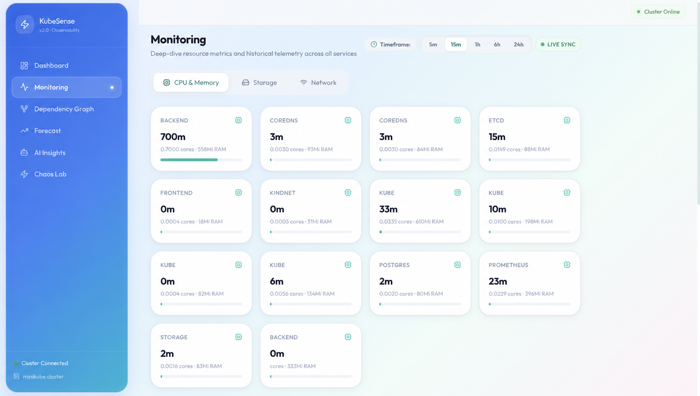
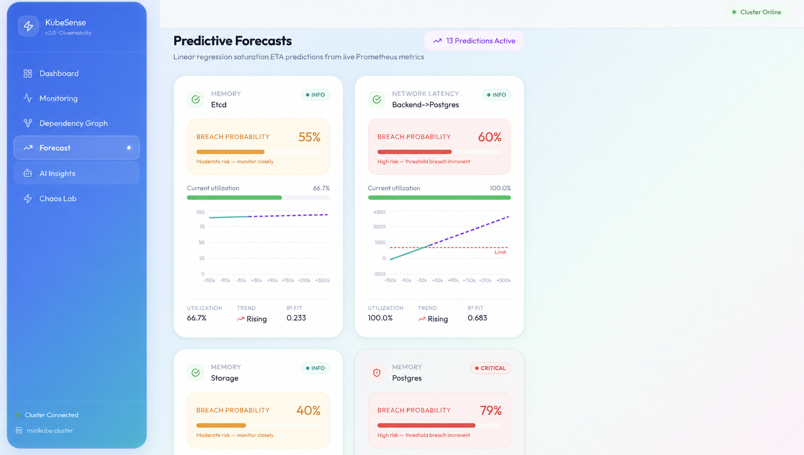
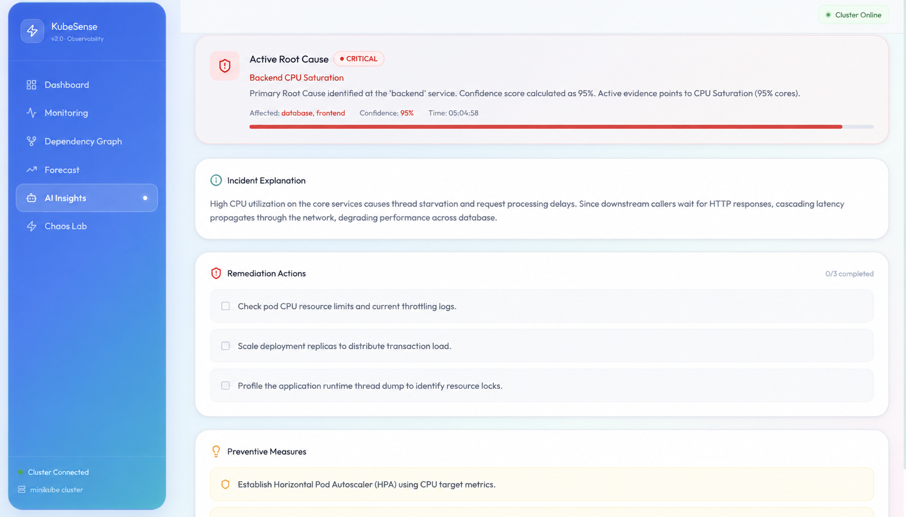
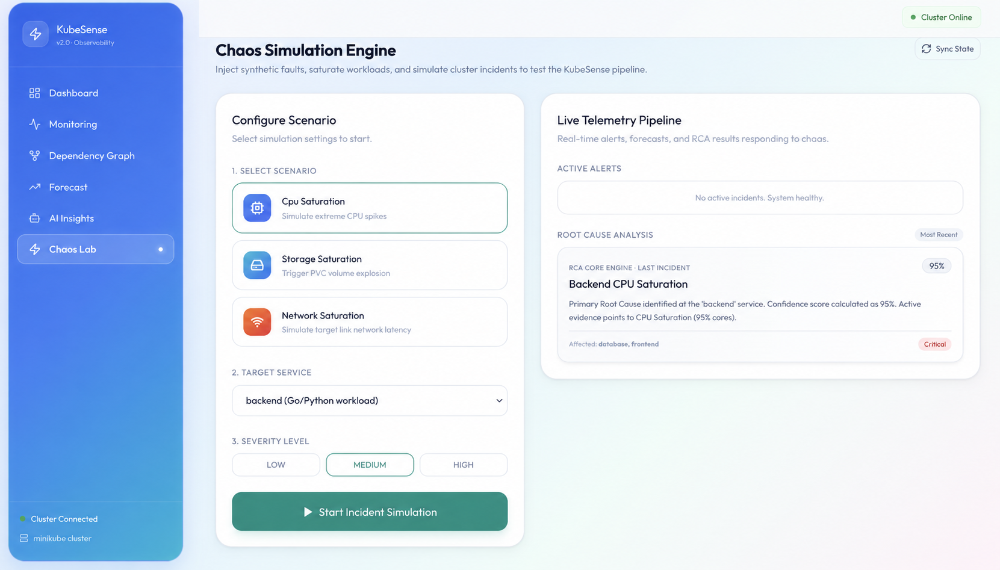

# KubeSense 🚀

**KubeSense** is a modern, AI-powered Kubernetes observability and monitoring platform. It combines real-time cluster metrics, automated anomaly detection, predictive resource forecasting, and interactive topology maps into a single, intuitive interface.

By analyzing live data stream telemetry directly from your Kubernetes cluster (via Prometheus), KubeSense helps developers and DevOps teams proactively detect issues, trace dependency chains, and determine the root cause of infrastructure anomalies before they impact production.

---

## 🔍 Live Application Screenshots

<div align="center">
  
  <p><em>Live Dashboard — cluster health, incident status, and historical telemetry</em></p>
  
  <br/>
  
  
  <p><em>Monitoring — live CPU, memory, storage, and network telemetry</em></p>
  
  <br/>
  
  
  <p><em>Predictive Forecasts — resource saturation risk and estimated threshold breaches</em></p>

  <br/>

  
  <p><em>AI Insights — root-cause analysis and remediation actions</em></p>

  <br/>

  
  <p><em>Chaos Lab — simulate CPU, storage, and network incidents safely</em></p>
</div>

---

## 🌟 Key Features

* **⚡ Real-time Cluster Telemetry**: Streams live CPU, PVC storage, and network metrics from Prometheus directly to the UI using high-performance WebSockets.
* **📈 Predictive AI/ML Forecasting**: Background agents analyze resource consumption trends using Scikit-Learn linear regression models, predicting exact timestamps when CPU or PVC storage will reach critical saturation thresholds.
* **🧠 Automated Root Cause Analysis (RCA)**: A background RCA correlation engine evaluates multi-dimensional failure vectors (CPU, disk, latency, topology adjacency) to pinpoint triggering components and calculate incident confidence scores.
* **🗺️ Interactive Dependency Graphs**: Visualizes the Kubernetes service mesh, pod replicas, and persistent volumes in dynamic, interactive topology maps built with ReactFlow.
* **💥 Chaos Engineering & Fault Simulation**: Built-in chaos engine simulates real-world failure modes (CPU stress spikes, PVC leak accumulation, packet drop spikes) without destabilizing your host VM.
* **🤖 Intelligent AI Recommendations**: Generates actionable remediation playbooks and scaling advice powered by Ollama / LLMs or deterministic heuristic fallbacks.

---

## 🛠️ Tech Stack

### Frontend
* **Core Framework**: React 18, TypeScript, Vite
* **Styling & UI**: Tailwind CSS & Framer Motion (for smooth micro-animations)
* **Data Visualization**: Recharts (live telemetry charts) & ReactFlow (interactive service mesh graphs)
* **State & Networking**: TanStack React Query, Axios, Native WebSockets

### Backend
* **API Framework**: FastAPI (Python 3.10+) with asynchronous event loops & WebSockets
* **Database & ORM**: PostgreSQL with SQLAlchemy ORM (with automatic SQLite fallback for zero-config local runs)
* **AI/ML & Analytics**: Scikit-Learn (predictive saturation linear regression) & NetworkX (service-mesh graph topology)
* **Cluster Client**: Official Kubernetes Python Client & Prometheus Service Query Engine
* **LLM Integration**: Ollama REST API integration with graceful heuristic fallback

### Infrastructure & Deployment
* **Orchestration**: Kubernetes manifests (Namespace, Deployments, Services, RBAC Roles, PVCs)
* **Monitoring**: Integrated Prometheus deployment scraping cAdvisor and node metrics
* **Containerization**: Optimized multi-stage Dockerfiles (Alpine & Slim bases)
* **Reverse Proxy**: Nginx for static asset serving and WebSocket reverse-proxying

---

## 📂 Project Structure

```text
KubeSense/
├── demo-app/
│   ├── backend/               # FastAPI backend & AI/ML worker agents
│   │   ├── agents/            # Telemetry, forecasting, chaos, & mapper workers
│   │   ├── api/               # REST API route controllers
│   │   ├── correlation/       # Root Cause Analysis (RCA) engine
│   │   ├── database/          # SQLAlchemy connection & dual-adapter engine
│   │   ├── models/            # SQLAlchemy ORM models & Pydantic schemas
│   │   ├── recommendation/    # AI recommendation & LLM client engine
│   │   ├── services/          # Prometheus HTTP query client
│   │   ├── Dockerfile         # Backend container build specification
│   │   ├── main.py            # FastAPI application entrypoint
│   │   └── requirements.txt   # Python package dependencies
│   ├── frontend/              # React + TypeScript + Vite UI application
│   │   ├── src/               # React components, pages, hooks, and services
│   │   ├── Dockerfile         # Multi-stage Nginx build container
│   │   ├── nginx.conf         # Container reverse proxy & WebSocket configuration
│   │   └── package.json       # Node.js dependencies and build scripts
│   └── k8s/                   # Kubernetes deployment configurations
│       ├── namespace.yaml     # tasksphere-app namespace definition
│       ├── rbac.yaml          # ClusterRole & ServiceAccount permissions
│       ├── prometheus.yaml    # In-cluster Prometheus deployment & scraping rules
│       ├── deployment.yaml    # Postgres, Backend, and Frontend workloads
│       └── service.yaml       # Service port bindings and NodePort definitions
├── docs/                      # Architectural specs, images, & verification guides
├── start.ps1                  # One-click startup automation script for Windows/Minikube
└── .gitignore                 # Configured git exclusions for clean commits
```

---

## ⚙️ Getting Started

You can run KubeSense in two different modes:

1. **Option 1: Local Standalone Mode (Zero-Config)**: Runs directly on your machine. Telemetry and anomalies are automatically simulated, and the database seamlessly falls back to a local SQLite database (`tasksphere.db`). No Minikube or PostgreSQL setup required.
2. **Option 2: Kubernetes Cluster Mode (Minikube)**: Runs inside a Kubernetes cluster, aggregating live cluster telemetry via Prometheus and persisting data in PostgreSQL.

---

### Option 1: Local Standalone Mode (Quickest)

#### Prerequisites
* Node.js (v18+)
* Python (v3.10+)

#### 1. Start Backend
```bash
cd demo-app/backend

# Create virtual environment
python -m venv venv

# Activate virtual environment
# Windows:
venv\Scripts\activate
# macOS / Linux:
source venv/bin/activate

# Install dependencies
pip install -r requirements.txt

# Run backend development server
uvicorn main:app --reload --host 0.0.0.0 --port 8000
```
> **Note**: In standalone mode, the backend automatically initializes a local SQLite file (`tasksphere.db`) and starts simulation workers.

#### 2. Start Frontend
```bash
# Open a new terminal
cd demo-app/frontend

# Install dependencies
npm install

# Run frontend development server
npm run dev
```
Open your browser at `http://localhost:5173`.

---

### Option 2: Kubernetes Cluster Mode (Minikube)

#### Prerequisites
* [Minikube](https://minikube.sigs.k8s.io/docs/start/)
* [Kubectl](https://kubernetes.io/docs/tasks/tools/)
* [Docker Desktop](https://www.docker.com/products/docker-desktop/)

#### Quick Start (Windows PowerShell)
Run the automated startup script from the root directory:
```powershell
.\start.ps1
```

#### Manual Deployment (Cross-Platform)

1. **Start Minikube**:
   ```bash
   minikube start --driver=docker
   ```

2. **Build and Load Docker Images**:
   ```bash
   # Build Backend image
   docker build -t tasksphere-backend:latest demo-app/backend/

   # Build Frontend image
   docker build -t kubesense-frontend:latest demo-app/frontend/

   # Load images into Minikube
   minikube image load tasksphere-backend:latest
   minikube image load kubesense-frontend:latest
   ```

3. **Apply Kubernetes Manifests**:
   ```bash
   kubectl apply -f demo-app/k8s/namespace.yaml
   kubectl apply -f demo-app/k8s/rbac.yaml
   kubectl apply -f demo-app/k8s/prometheus.yaml
   kubectl apply -f demo-app/k8s/deployment.yaml
   kubectl apply -f demo-app/k8s/service.yaml
   ```

4. **Verify Pod Status**:
   ```bash
   kubectl get pods -n tasksphere-app
   ```

5. **Expose & Access the Application**:
   ```bash
   # Method A: Port-forward frontend service
   kubectl port-forward svc/frontend-service 8080:80 -n tasksphere-app

   # Method B: Minikube service command
   minikube service frontend-service -n tasksphere-app
   ```
   Access the dashboard in your browser at `http://localhost:8080`.

---

## 🔧 Environment Variables & Configuration

The backend supports configuration via environment variables:

| Variable | Default Value | Description |
| :--- | :--- | :--- |
| `POSTGRES_HOST` | `postgres-service` | PostgreSQL host (falls back to SQLite if unreachable) |
| `POSTGRES_PORT` | `5432` | PostgreSQL database port |
| `POSTGRES_DB` | `tasksphere` | PostgreSQL database name |
| `POSTGRES_USER` | `postgres` | Database user |
| `POSTGRES_PASSWORD` | `postgres` | Database password |
| `PROMETHEUS_URL` | `http://prometheus:9090` | In-cluster Prometheus scraping endpoint |
| `OLLAMA_URL` | `http://host.minikube.internal:11434` | Ollama LLM endpoint for AI recommendations |
| `OLLAMA_MODEL` | `llama3.1:latest` | Ollama model identifier |

---

## 📡 API Reference Overview

| Endpoint | Method | Description |
| :--- | :--- | :--- |
| `/api/ws/telemetry` | `WS` | Real-time WebSocket streaming cluster metrics, forecasts, & RCA reports |
| `/api/dependencies` | `GET` | Discovered service mesh graph nodes and edges |
| `/api/metrics/summary` | `GET` | Unified cluster metrics snapshot (CPU, PVC, Network) |
| `/api/alerts/` | `GET` | List of active resource threshold alerts |
| `/api/rca/` | `GET` | List of recent Root Cause Analysis reports |
| `/api/forecast/` | `GET` | Predictive resource saturation forecasts and ETAs |
| `/api/recommendations/` | `GET` | AI-generated remediation playbooks |
| `/api/chaos/inject` | `POST` | Trigger simulated chaos fault injection |
| `/api/chaos/reset` | `POST` | Reset active chaos injections |

---

## 🧪 Verification & Diagnostics

For in-depth diagnostic commands (inspecting cgroups, cAdvisor Prometheus scraping, PVC volume stats, and Docker Desktop metrics), refer to:
* 📄 [`docs/verification_commands.txt`](docs/verification_commands.txt)
* 📄 [`docs/project_details.txt`](docs/project_details.txt)

---

## 📤 Pushing to an Existing Git Repository

To push this project to an existing Git repository, execute the following commands from the root directory:

```bash
# 1. Initialize git (if not already initialized)
git init

# 2. Add your remote repository (replace with your repo URL)
git remote add origin <YOUR_REMOTE_REPOSITORY_URL>
# (Or if origin already exists: git remote set-url origin <YOUR_REMOTE_REPOSITORY_URL>)

# 3. Stage all files
git add .

# 4. Commit changes
git commit -m "feat: complete KubeSense AI observability platform"

# 5. Push to remote main branch
git branch -M main
git push -u origin main
```

---

## 📄 License
This project is open-source and available under the [MIT License](LICENSE).
